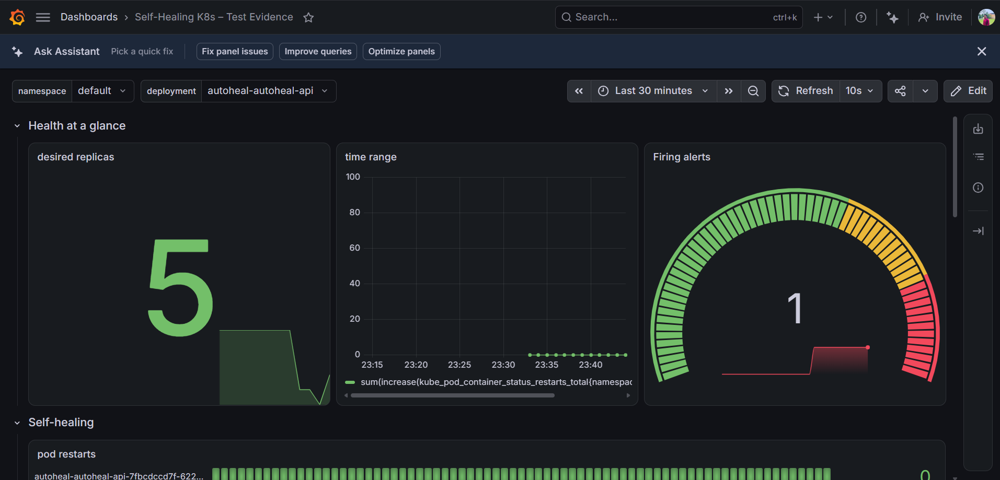
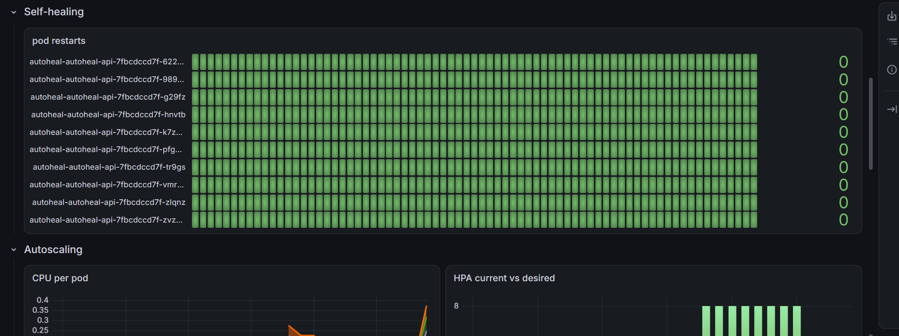
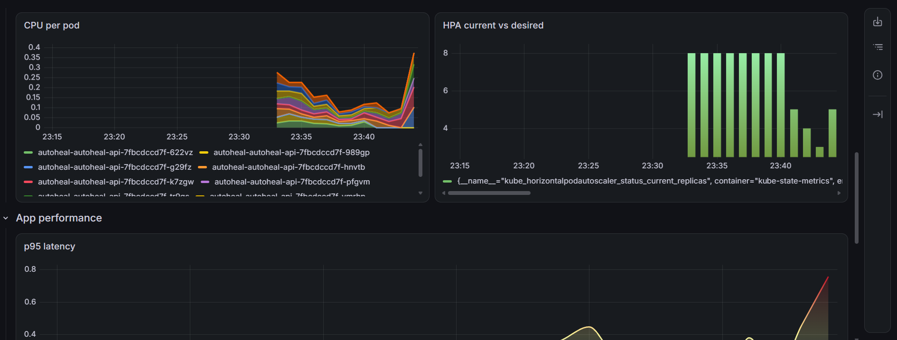

# autoheal-k8s

Self-healing, autoscaling Kubernetes demo. Full proposal in [claude.md](claude.md).

A small stateless API (`app/`) is deployed to Kubernetes with liveness, readiness
and startup probes, a `RollingUpdate` strategy, a `PodDisruptionBudget`, and a
`HorizontalPodAutoscaler`. Scripted chaos (`chaos/`) kills pods, hangs the event
loop, flips readiness, ships a broken rollout, and drains a node; scripted load
(`load/`, k6) drives a traffic spike. A `kube-prometheus-stack` install
(`observability/`) turns each recovery or scaling event into a live Grafana
dashboard and Prometheus alerts, so the claim "it self-heals and autoscales" is
measured, not asserted. It runs locally on `kind`, and the same Helm chart
deploys to OKE (Oracle Cloud) for the Cluster Autoscaler test (T9). See
[docs/test-report.md](docs/test-report.md) for each scenario's expected vs.
observed result.

## Dashboard

The Grafana dashboard (`observability/grafana-dashboard.json`) is the single
screen that tells the whole self-healing/autoscaling story: desired replicas,
firing alerts, per-pod restart counts, CPU per pod, and HPA current vs. desired
replicas, all live over the last 30 minutes.







## Local setup

```bash
# 1. App: install deps, run tests
cd app
npm install
npm test

# 2. Build the image
docker build -t autoheal-api:dev .

# 3. Create the local cluster (control-plane + 2 workers, ports 8080/8443 mapped for ingress)
cd ..
kind create cluster --config kind/kind-config.yaml

# 4. Load the image into the cluster (kind nodes can't pull local-only images)
kind load docker-image autoheal-api:dev --name autoheal

# 5. Install an ingress controller (ingress-nginx, kind-flavored manifest)
kubectl apply -f https://raw.githubusercontent.com/kubernetes/ingress-nginx/main/deploy/static/provider/kind/deploy.yaml

# The controller binds hostPort 80/443, but only the control-plane node carries
# the extraPortMappings from kind-config.yaml. Pin it there, or localhost:8080
# will return empty replies.
kubectl patch deployment -n ingress-nginx ingress-nginx-controller --type=strategic \
  -p '{"spec":{"template":{"spec":{"nodeSelector":{"kubernetes.io/os":"linux","ingress-ready":"true"}}}}}'

kubectl wait --namespace ingress-nginx \
  --for=condition=ready pod \
  --selector=app.kubernetes.io/component=controller \
  --timeout=120s

# 6. Deploy the app
helm install autoheal helm/autoheal-api

# 7. Hit it (maps to ingress.host in values.yaml)
curl -H "Host: autoheal.local" http://localhost:8080/healthz
```

## Observability

Run these once the cluster from the previous section is up. The values file trims
retention and resources so the stack fits alongside kind on a laptop.

```bash
# 1. Install the monitoring stack (release name must be "monitoring": the chart
#    only discovers ServiceMonitors/PrometheusRules labelled release=monitoring)
helm repo add prometheus-community https://prometheus-community.github.io/helm-charts
helm repo update
helm install monitoring prometheus-community/kube-prometheus-stack \
  -n monitoring --create-namespace \
  -f observability/values-kube-prometheus-stack.yaml

# 2. Point Prometheus at the app
helm upgrade autoheal helm/autoheal-api --set serviceMonitor.enabled=true

# 3. Load the dashboard (the Grafana sidecar watches for this label)
kubectl create configmap autoheal-dashboard \
  -n monitoring --from-file=observability/grafana-dashboard.json
kubectl label configmap autoheal-dashboard -n monitoring grafana_dashboard=1

# 4. Load the alert rules
kubectl apply -f observability/alert-rules.yaml

# 5. Open Grafana (admin / admin) and Prometheus
kubectl port-forward -n monitoring svc/monitoring-grafana 3000:80
kubectl port-forward -n monitoring svc/monitoring-kube-prometheus-prometheus 9090:9090
```

Verify the app is actually being scraped at Prometheus → Status → Targets, or:

```bash
curl -s 'http://localhost:9090/api/v1/query?query=up{job="autoheal-api"}'
```

| File | Purpose |
|---|---|
| [observability/values-kube-prometheus-stack.yaml](observability/values-kube-prometheus-stack.yaml) | Slimmed stack config for kind |
| [observability/grafana-dashboard.json](observability/grafana-dashboard.json) | Dashboard: RED metrics, replicas, HPA, restarts, readiness, nodes |
| [observability/alert-rules.yaml](observability/alert-rules.yaml) | Crash-loop, HPA-at-max, error-rate and PDB alerts |

## Chaos scenarios

Each script asserts a pass condition and exits non-zero on failure. Measured
results are in [docs/test-report.md](docs/test-report.md).

```bash
make chaos-pod      # T1: delete a pod, expect recovery under 30s
make chaos-crash    # T2: /crash, expect in-place container restart
make chaos-hang     # T3: /hang, expect liveness to restart it
make chaos-unready  # T4: /ready 503, expect endpoint removal without restart
make chaos-rollout  # T7: readiness never passes, expect stalled rollout + undo
make chaos-drain    # T8: drain a node, expect the PDB to hold
make chaos-all      # everything, with a results table
```

`make chaos-all` runs each scenario under steady k6 background traffic (10 req/s,
kept low enough that one pod can carry it, so the HPA does not scale mid-scenario) and reports failed user
requests per scenario alongside PASS/FAIL. `LOAD=0` turns the traffic off.
Tune it with `BG_RATE` and `BG_WORK_MS`.

It also writes each scenario's time window to `load/results/`. With the
monitoring stack installed, turn those windows into dashboard screenshots with:

```bash
bash observability/snapshot.sh load/results/chaos-<stamp>-windows.tsv docs/img
```

That uses headless Chrome or Edge and Grafana's anonymous read-only access.

**Laptop limits.** On an 8 GB machine, kind plus kube-prometheus-stack plus a
load test does not fit. The Docker VM thrashed (load average 66, half of all CPU
time in the kernel), the API server restarted, and idle pods reported phantom
CPU that kept the HPA scaled out. Measured runs were therefore done **without**
the monitoring stack. Install it only for dashboards and screenshots, or on a
machine with 16 GB or more.

Resilience settings live in [helm/autoheal-api/values.yaml](helm/autoheal-api/values.yaml):
`maxUnavailable: 0` (a new pod must be Ready before an old one goes), a
PodDisruptionBudget with `minAvailable: 1`, and `topologySpreadConstraints` to
spread replicas across nodes.

Spreading uses `topologySpreadConstraints` rather than preferred
`podAntiAffinity`: the latter is only a scheduler hint, and in testing it placed
both replicas on the same node — the exact failure it was meant to prevent.
`whenUnsatisfiable: ScheduleAnyway` is deliberate, so the HPA can still scale to
8 replicas on a 2-worker cluster instead of leaving pods Pending.

## Autoscaling

```bash
# 1. Metrics Server (kind needs --kubelet-insecure-tls; see kind/metrics-server-values.yaml)
make metrics-server
kubectl top pods          # should show CPU/memory within ~30s

# 2. Deploy with the HPA (on by default: min 2, max 8, target 60% CPU)
make deploy
kubectl get hpa           # TARGETS should read e.g. "cpu: 3%/60%", not <unknown>

# 3. T5 + T6: k6 spike on /work, then scale-in (~20 min end to end)
make load-spike

# Steady background traffic, e.g. to measure availability during a chaos run
RATE=100 DURATION=3m make load-steady
```

k6 does not need to be installed: [load/k6.sh](load/k6.sh) uses a local `k6` if
present, and otherwise runs the `grafana/k6` image on the `kind` Docker network,
aimed at the control-plane node where the ingress controller listens.

| File | Purpose |
|---|---|
| [helm/autoheal-api/templates/hpa.yaml](helm/autoheal-api/templates/hpa.yaml) | `autoscaling/v2` HPA with scale-up/scale-down behaviour policies |
| [kind/metrics-server-values.yaml](kind/metrics-server-values.yaml) | Metrics Server values for kind |
| [load/spike.js](load/spike.js) | T5: ramp 10 → 500 VUs over 5 min on `/work`, hold 3 min |
| [load/steady.js](load/steady.js) | Constant-arrival-rate background traffic |
| [chaos/t5-t6-autoscale.sh](chaos/t5-t6-autoscale.sh) | Runs the spike, asserts scale-up, availability, scale-in and no flapping |

HPA behaviour, from [values.yaml](helm/autoheal-api/values.yaml):

- **Scale-up:** no stabilisation window, at most +100% per 60s, so 2 → 4 → 8.
- **Scale-down:** 300s stabilisation window (anti-flapping), then at most −50%
  per 60s, so 8 → 4 → 2. Expected total ≈ 1 min metric lag + 5 min window + 1–2
  min of steps, inside the 10 min target.
- The Deployment omits `spec.replicas` while the HPA is enabled. Otherwise every
  `helm upgrade` would reset the replica count to 2 in the middle of a scale-out.
  **Upgrading an existing release** from the Week 4 chart removes the field, and
  Kubernetes briefly defaults it to 1 until the HPA restores 2 (about 15s). Do
  that upgrade outside a test run.

Load is tuned through environment variables: `PEAK_VUS`, `RAMP`, `HOLD`,
`WORK_MS` and `THINK_S`. Offered load is about `PEAK_VUS / THINK_S` req/s, each
costing `WORK_MS` of CPU. The defaults (500 VUs, 10 ms, 3 s) produce roughly 1.7
cores of work. That saturates 2 pods (0.6 cores of limits) but fits within 8
(2.4 cores), so p95 latency should recover once the app has scaled out. On a
smaller laptop, lower `PEAK_VUS`.


## Cloud: OKE and the Cluster Autoscaler (Oracle Cloud)

The cloud run of T9 (Cluster Autoscaler adding a node under pending pods),
on Oracle Kubernetes Engine, using the same Helm chart, monitoring stack and
chaos scripts as the local `kind` setup above. Defaults to OCI's **Always Free** shapes (2–4 × `VM.Standard.A1.Flex`, 1 OCPU/6GB each,
one 10Mbps flexible load balancer), so a normal run of this **costs $0** —
see the sizing math and how to switch to a bigger, billed cluster below.

One-time setup:

```bash
# Install the OCI CLI: https://docs.oracle.com/iaas/Content/API/SDKDocs/cliinstall.htm
oci setup config      # writes ~/.oci/config: tenancy, user, region, API key
```

Run:

```bash
# VCN, OKE (2-4 Always Free A1.Flex nodes), OCIR image push (built for
# arm64), ingress-nginx (capped at 10Mbps -- the Always Free LB ceiling),
# cluster-autoscaler, monitoring stack, app. COMPARTMENT_OCID is required
# (oci iam compartment list, or the tenancy OCID from ~/.oci/config for a
# fresh account). Optional: LOCATION=eu-frankfurt-1 (default: the region in
# ~/.oci/config).
COMPARTMENT_OCID=<COMPARTMENT_OCID> make oke-up

export BASE_URL=http://<LB_IP> K6_NETWORK=bridge   # up.sh prints the IP

make chaos-ca       # T9: pods Pending -> Cluster Autoscaler adds a node
make load-spike     # T5/T6
make chaos-all      # T1-T8

make oke-down       # same day
```

| File | Purpose |
|---|---|
| [infra/oke/](infra/oke/) | Terraform: VCN (public subnets for the k8s API, nodes and load balancer), OKE cluster, one node pool |
| [infra/oke/up.sh](infra/oke/up.sh) / [down.sh](infra/oke/down.sh) | End-to-end bring-up and teardown, including the Kubernetes `cluster-autoscaler` (OCI has no built-in min/max toggle like AKS/GKE) |
| [infra/oke/ci-setup.sh](infra/oke/ci-setup.sh) | One-time IAM user + API key for the `deploy-oke` CI job, and a dynamic group + policy so the autoscaler can resize the node pool via instance-principal auth |

OKE-specific details:
- **No OIDC federation.** Unlike Azure/GCP, OCI has no workload-identity
  federation simple enough for GitHub Actions here, so `deploy-oke` uses the
  API signing key `ci-setup.sh` creates instead of `id-token: write`.
- **Cluster Autoscaler is a Helm install, not a cluster toggle.** `up.sh`
  deploys `kubernetes/autoscaler`'s OCI provider, pointed at the node pool's
  OCID with `--nodes=min:max:poolID`. It authenticates as the node's own
  instance principal, which `ci-setup.sh`'s dynamic group + policy grants.
- **metrics-server isn't preinstalled**, unlike AKS/GKE; `up.sh` installs it.
- **Always Free sizing.** `node_ocpus x max_nodes` must stay ≤ 4 and
  `node_memory_gbs x max_nodes` ≤ 24 (the Ampere allowance is per-tenancy,
  not per-cluster); `boot_volume_size_in_gbs x max_nodes` must stay under the
  200GB block-storage allowance. The defaults (1 OCPU / 6GB / 50GB boot, 4
  nodes max) land exactly at the OCPU and memory ceilings with zero headroom
  in either dimension — lower `MAX_NODES` first if a create fails on quota.
  `up.sh` detects the arm64 shape from Terraform's output and builds the app
  image for `linux/arm64` with `docker buildx` automatically; needs Docker
  Desktop or a buildx builder with the QEMU emulator on an x86 laptop.
- **A1.Flex capacity varies by region/AD.** "Out of host capacity" on
  `terraform apply` is common for the free Ampere shape; retry, or try
  another `LOCATION`.
- **Bigger, billed cluster:** `NODE_SHAPE=VM.Standard.E4.Flex NODE_OCPUS=1
  NODE_MEMORY_GBS=8 LB_BANDWIDTH_MBPS=100 COMPARTMENT_OCID=<...> make oke-up`
  switches to AMD nodes and a faster load balancer (trial credits or a paid
  account only — the Always Free shapes don't apply to E4.Flex).
- **Cleanup.** The OCI Load Balancer behind ingress-nginx is created by
  Kubernetes, not Terraform, so `down.sh` removes it first, then lists any
  leftover load balancers, instances or public IPs in the compartment.
- Cost controls: `max_nodes = 4`, a single public VCN (no NAT gateway to pay
  for), and the Cluster Autoscaler's own scale-down-unneeded default.

CI deploy (optional): run `COMPARTMENT_OCID=<COMPARTMENT_OCID> bash
infra/oke/ci-setup.sh`, bring the cluster up with `make oke-up`, and add the
printed repository secrets/variables. Pushes to `main` then roll the
Trivy-scanned image out to OKE. Terraform grants the CI group access to only
this compartment's registry and cluster, so it has no access while the
cluster is down.

## Endpoints

| Path | Purpose |
|---|---|
| `GET /healthz` | Liveness probe target |
| `GET /ready` | Readiness probe target |
| `GET /startupz` | Startup probe target |
| `GET /work?durationMs=` | CPU-heavy endpoint for load testing |
| `GET /hang?durationMs=` | Blocks the event loop (simulates a hung app) |
| `POST /crash` | Exits the process (simulates a crash) |
| `POST /chaos/unready` | Forces `/ready` to 503 for N seconds |
| `GET /metrics` | Prometheus metrics |
